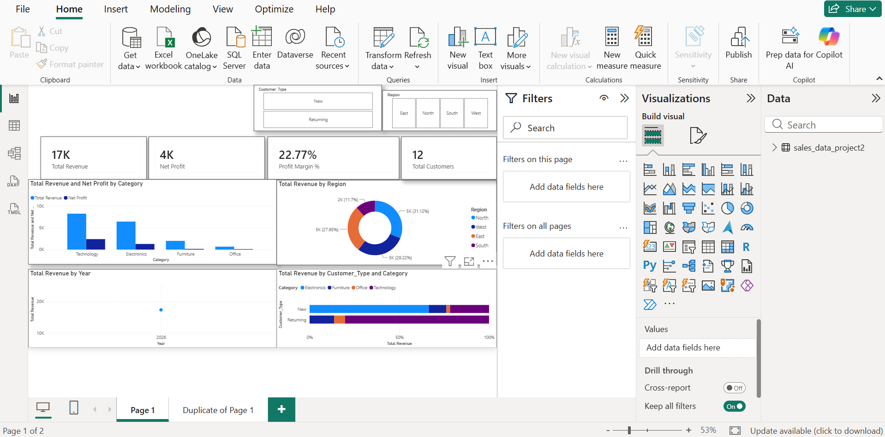

# Power BI Sales & Revenue Analysis Showcase

## 📊 Project Overview
This interactive Power BI dashboard provides a high-level view of overall revenue, profitability, regional performance, and customer segment metrics. It allows business stakeholders to slice and dice financial data to identify top-performing markets and customer buying behavior.

---

## 📸 Dashboard Preview


---

## 🎥 Video Demonstration
Watch the interactive walkthrough demonstrating slicer filters, hover interactions, and dynamic visual updates:

[▶️ Click Here to Watch the 40-Second Dashboard Demo](dashboard_demo.mp4)

---

## ⚙️ Key DAX Calculations
Here are the dynamic DAX measures driving the main KPI cards in this report:

```dax
// 1. Total Revenue Measure
Total Revenue = SUM(Sales[Revenue])

// 2. Net Profit Margin Percentage
Profit Margin % = 
DIVIDE(
    SUM(Sales[Net_Profit]), 
    [Total Revenue], 
    0
)

// 3. Customer Retention Count
Returning Customers = 
CALCULATE(
    COUNT(Sales[Customer_ID]), 
    Sales[Customer_Type] = "Returning"
)

